# AI Agent Disign Pattern

[Sample Codes](https://github.com/GenerativeAgents/agent-book)

## 目標設定と計画生成

### 1. Passive Goal Creator
- ユーザの入力から目標を抽出する

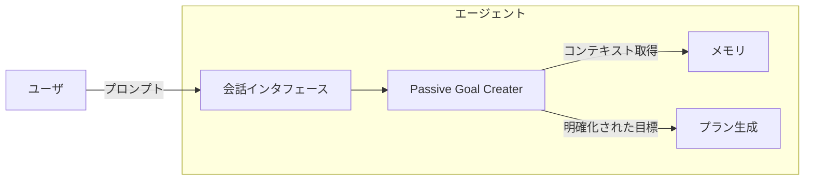

### 2. Proactive Goal Creator
- 環境や状況から能動的に目標を生成する

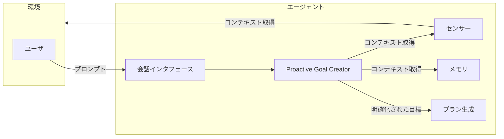

### 3. Prompt/Response Optimizer
- プロンプトの応答を最適化する

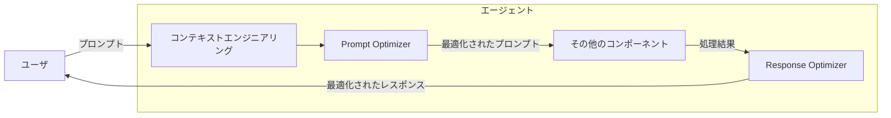

### 4. Single-Path Plan Generator
- 単一パスの実行計画を生成する

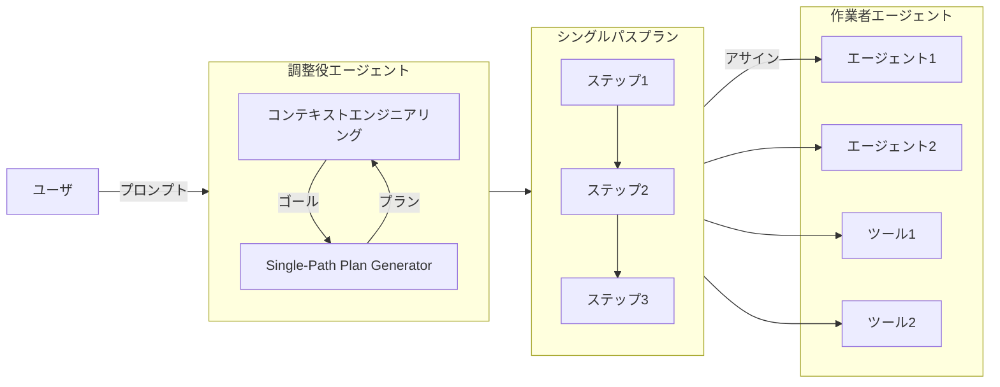

### 5 Multi-Path Plan Generator
- 複数パスの実行計画を生成する

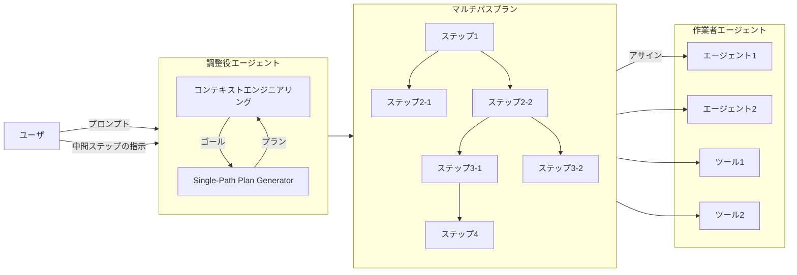

### 6. One-Shot Model Querying
- 単一のクエリでプラン生成を進める

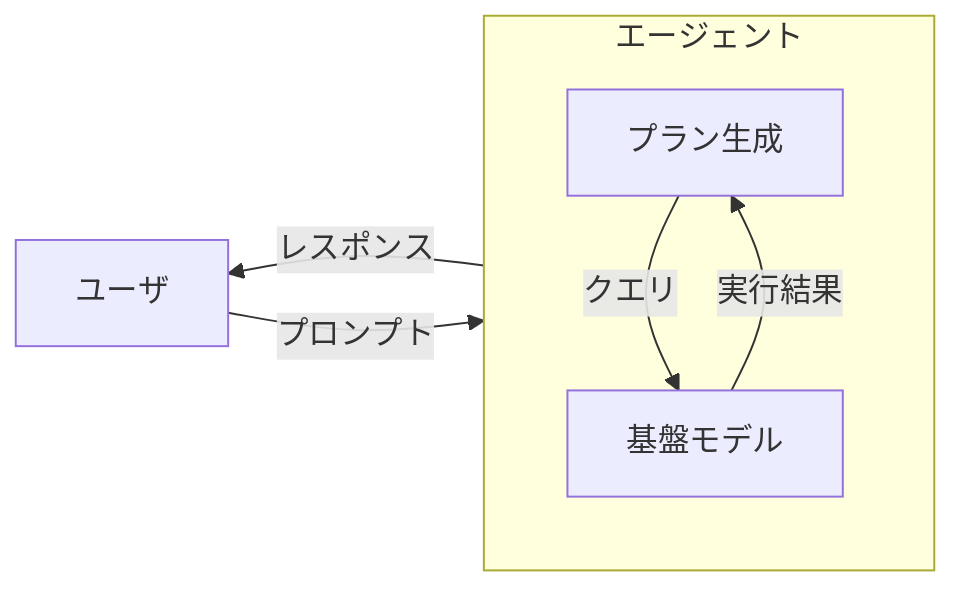

### 7. Incremental Model Querying
- 複数回のクエリで段階的にプラン生成を進める

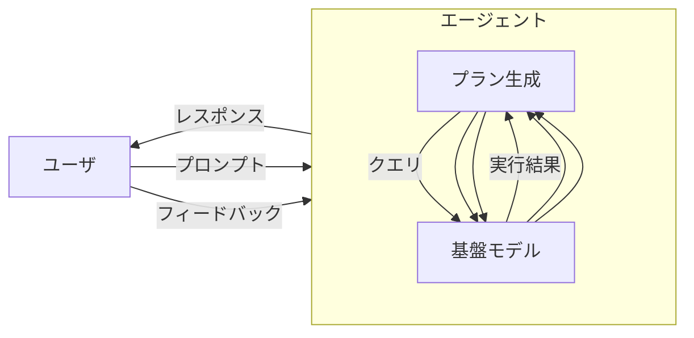

## 推論の確実性向上

### 8. Retrieval-Augmented Generation: RAG
- 外部情報を活用して生成を行う

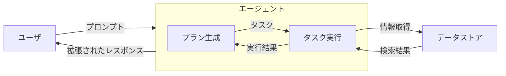

### 9. Self-Reflection
- 自身の出力を評価し改善する

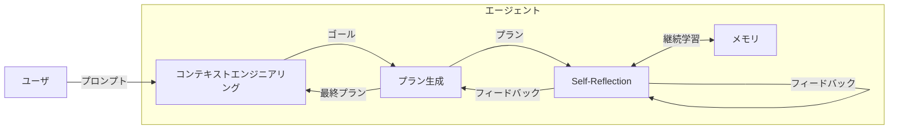

### 10. Cross-Reflection
- 他のモデル、エージェントによる評価を行う

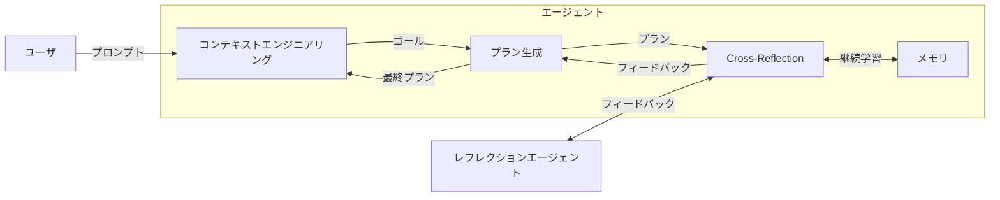

### 11. Human Relfection
- 人間からのフィードバックを取り入れる

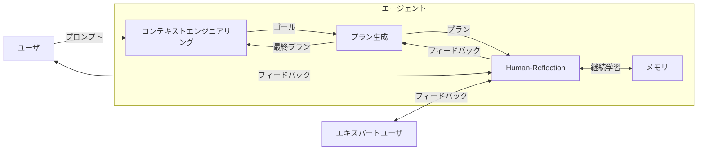

### 12. Agent Evaluator
- エージェントの性能を評価する

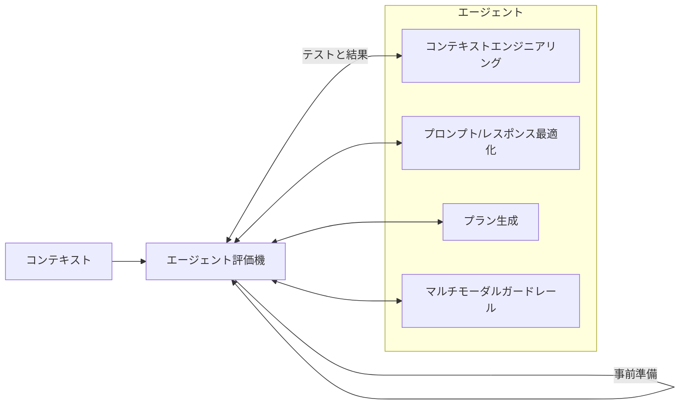

## エージェント間の協調

### 13. Voting-Based Cooperation
- 投票によって意思決定を行う

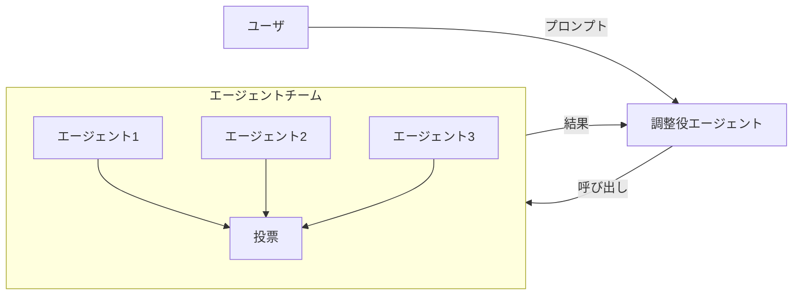

### 14. Role-Based Cooperation
- 役割に基づいて協力する

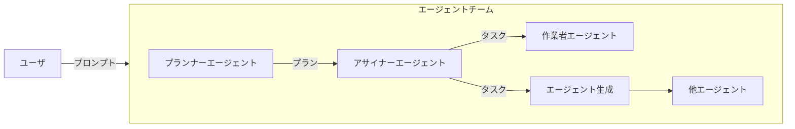

### 15. Debated-Based Cooperation
- 議論を通じて合意形成を行う

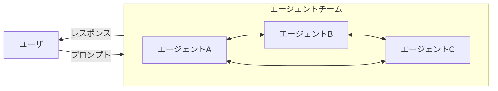

## 入出力制御

### 16. Multimodal Guardrails
- 多様な形式の入出力を制御する

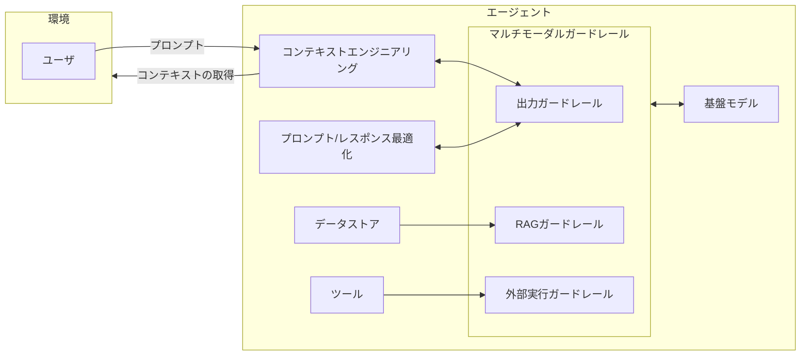

### 17.Tool/Agent Registry
- ツールやサブエージェントを活用する

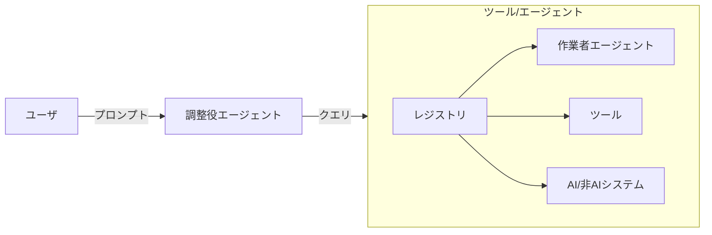

### 18. Agent Adapter
- 外部ツールとのインターフェースを提供する

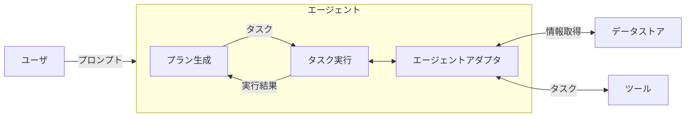
